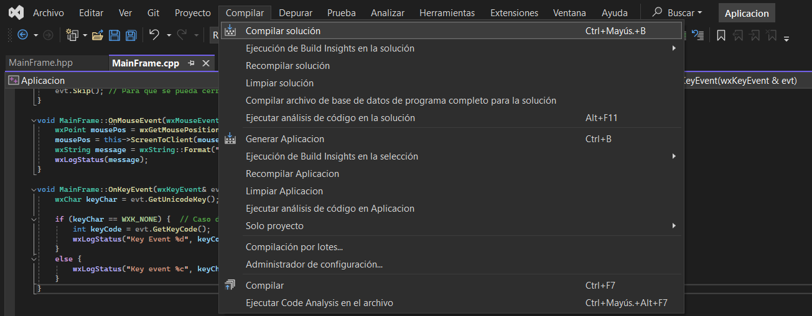
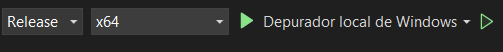

# Instrucciones de ejecución
    Para utilizar el programa "Aplicacion", se debe abrir el archivo "Aplicacion.sln", seguidamente se debe presionar la opcion de "compilar solucion" en el menu de herramientas de visual estudio como se muestra en la siguiente figura:

    Por último, se debe presionar la opcion de depurar con el depurador local de windows en caso de estar en windows:

