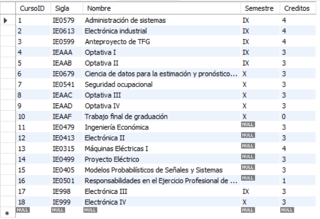
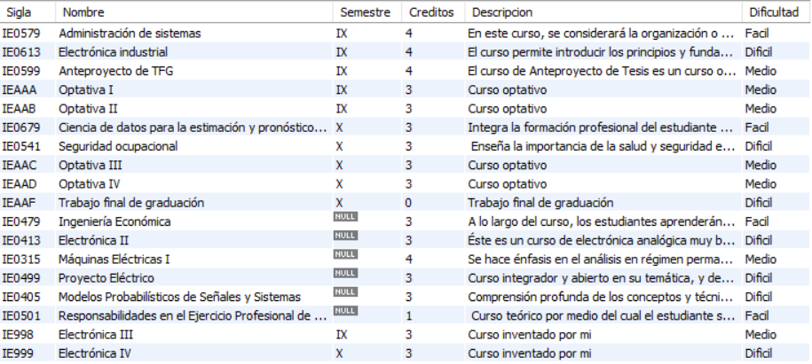
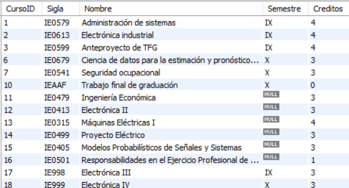
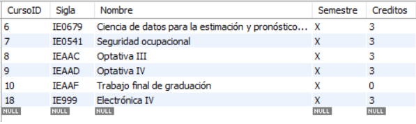
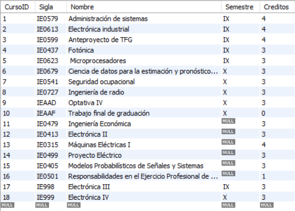
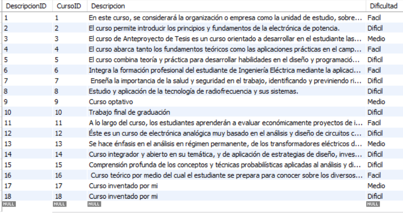
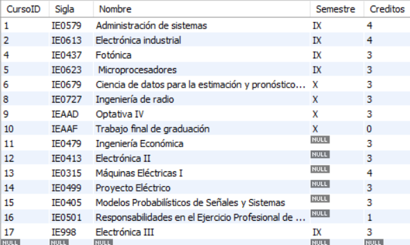
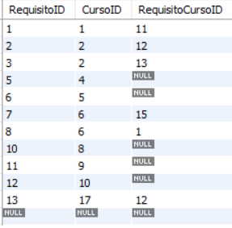
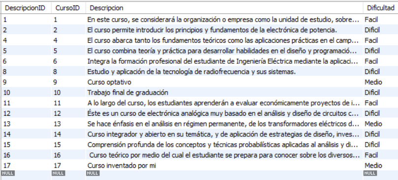
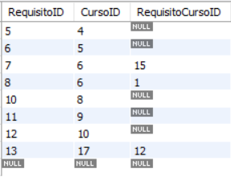

# Parte teórica

**1. ¿Qué es una base de datos relacional y cuáles son sus características fundamentales?**

    Una base de datos relacional es un tipo de base de datos que organiza los datos en tablas que pueden ser manipuladas utilizando el lenguaje SQL (Structured Query Language). Las características fundamentales de una base de datos relacional son:

``Los datos se aseguran mediante restricciones como claves primarias, claves foráneas, y restricciones únicas, permitiendo así una mejor integridad de datos.``

``Las tablas pueden relacionarse entre sí mediante claves foráneas, permitiendo consultas complejas y operaciones en datos relacionados.``

``Posee un soporte para transacciones, que son un conjunto de operaciones que se ejecutan como una unidad.``

``Permite el uso de SQL para consultar y manipular los datos.``

**2. ¿Cuál es la diferencia entre una clave primaria y una clave candidata en una base de datos relacional?**

    La clave primaria ss un campo que identifica de manera única cada registro en una tabla. Una tabla puede tener solo una clave primaria, mientras que una clave candidata corresponde a aquellos campos que tienen el potencial de ser clave primaria, ya que también identifican de manera única los registros. Una tabla puede tener múltiples claves candidatas, pero solo una de ellas puede ser designada como clave primaria

**3. ¿Qué son las claves foráneas y cómo se utilizan para mantener la integridad referencial en una base de datos?**

    Son campos en una tabla que se refieren a la clave primaria de otra tabla. Se utilizan para establecer y reforzar la integridad referencial, que asegura que las relaciones entre tablas permanecen consistentes, la integridad referencial asegura que cualquier valor de una clave foránea en una tabla debe coincidir con un valor de la clave primaria en la tabla referenciada.

**4. ¿Qué es una transacción en el contexto de bases de datos y cuáles son las propiedades ACID que debe cumplir?**

    Una transacción es una secuencia de operaciones realizadas como una unidad única de trabajo, que se debe completar en su totalidad para mantener la coherencia de la base de datos.Las propiedades ACID que debe cumplir son:

``Atomicidad``: La transacción se ejecuta completamente o no se ejecuta en absoluto.  
``Consistencia``: La transacción lleva la base de datos de un estado válido a otro estado válido.  
``Aislamiento``: Las transacciones concurrentes no deben interferir entre sí.  
``Durabilidad``: Una vez que una transacción se ha confirmado, sus cambios son permanentes.  
  
**5. ¿Qué son las vistas (views) en SQL y cuáles son los beneficios y limitaciones de su uso?**

    Una vista en SQL es una consulta guardadas que puede ser tratada como una tabla virtual. Los beneficios y limitaciones incluyen:

``Beneficios``:  

    Simplifican consultas complejas.  
    Mejoran la seguridad al limitar el acceso a datos sensibles.
    Presentación de datos personalizados para diferentes usuarios.  

``Limitaciones``:  

    Pueden afectar el rendimiento si son demasiado complejas.  
    No siempre se pueden actualizar directamente.  


**6. ¿Qué es la normalización en bases de datos y cuáles son las diferentes formas normales (normal forms)?**

    La normalización es el proceso de organizar los datos en una base de datos para reducir la redundancia y mejorar la integridad de los datos. Las diferentes formas normales son:


``Primera Forma Normal (1NF)``: Eliminar duplicación de grupos de columnas.  
``Segunda Forma Normal (2NF)``: Eliminar dependencia parcial de claves.  
``Tercera Forma Normal (3NF)``: Eliminar dependencias transitivas.  
``Forma Normal de Boyce-Codd (BCNF)``: Una versión más estricta de 3NF.  
``Cuarta Forma Normal (4NF)``: Eliminar dependencias multivaluadas.  
``Quinta Forma Normal (5NF)``: Eliminar redundancias en las relaciones.  

**7. ¿Cómo funcionan los índices en SQL y cuál es su impacto en el rendimiento de las consultas?**

    Los índices en SQL son estructuras de datos que mejoran la velocidad de las operaciones de consulta en una tabla a costa de un mayor uso de almacenamiento y tiempos de escritura. Los índices funcionan como tablas de búsqueda que los motores de base de datos utilizan para localizar rápidamente los datos. Sin embargo, puede afectar negativamente las operaciones de INSERT, UPDATE y DELETE debido a la necesidad de mantener los índices.

**8. ¿Qué es SQL Injection y cuáles son las mejores prácticas para prevenir este tipo de ataque?**

    SQL Injection es un tipo de ataque en el cual un atacante puede ejecutar código SQL arbitrario en una base de datos, comprometiendo su seguridad. Las mejores prácticas para prevenirlo incluyen:

    1. Usar sentencias preparadas: Con parámetros en lugar de concatenar cadenas.  
    2. Validar y sanitizar entradas del usuario.  
    3. Usar procedimientos almacenados.  
    4. Configurar los permisos de la base de datos adecuadamente.  
    5. Monitorear y registrar actividades sospechosas.  


**9. ¿Qué son los procedimientos almacenados (stored procedures) en SQL y cómo pueden mejorar la eficiencia y seguridad de las operaciones de base de datos?**

    Los procedimientos almacenados son conjuntos de sentencias SQL precompiladas y almacenadas en la base de datos. Pueden mejorar la eficiencia y seguridad al reducir el tráfico entre la aplicación y la base de datos y reutilizar código y al limitar el acceso directo a las tablas, encapsulando la lógica de negocio.

**10. ¿Cómo se implementan las relaciones uno a uno, uno a muchos y muchos a muchos en una base de datos relacional y qué consideraciones se deben tener en cuenta en cada caso?**

``Uno a Uno (1:1): ``

    Se implementa usando una clave primaria compartida o una clave foránea única en ambas tablas.  
    Como consideración se deberia usar restricciones UNIQUE en la clave foránea.

``Uno a muchos (1:n): ``

    Se implementa usando una clave foránea en la tabla "muchos" que referencia la clave primaria de la tabla "uno".  
    Como consideración, asegurarse de que la clave foránea en la tabla "muchos" corresponda a un registro válido en la tabla "uno"

``muchos a muchos (m:n): ``

    Se implementa mediante una tabla intermedia (tabla de unión) que contiene claves foráneas que referencian las claves primarias de las dos tablas relacionadas.
    Como consideración, asegurarse de que la tabla intermedia tenga claves foráneas y, opcionalmente, una clave primaria compuesta de las dos claves foráneas. Y considerar el impacto en el rendimiento y la complejidad de las operaciones de inserción y eliminación masivas.


# Parte Práctica:

## **Creación de la Base de datos**

Se utiliza el siguiente comando para crear la base de datos "plan_estudios"

```bash
CREATE DATABASE plan_estudios;
```

Y ahora esta debe aparecer en los esquemas creados


## **Creación de las Tablas**

### _Creación de la Tabla Cursos_

La Tabla cursos tendrá como columnas lo siguiente: 

``CursoID`` Clave primaria  
``Sigla`` Clave candidata  
``Nombre`` Clave candidata  
``Semestre``  
``Creditos``  

Y se utilizará el siguiente código para crear esta tabla:
```bash
CREATE TABLE plan_estudios.cursos (
	CursoID INT NOT NULL AUTO_INCREMENT,
	Sigla VARCHAR(45),
	Nombre VARCHAR(100) NOT NULL,
	Semestre VARCHAR(45),
	Creditos INT NOT NULL,
	PRIMARY KEY (CursoID),
	UNIQUE(Sigla),
	UNIQUE(Nombre),
    CHECK(creditos>=0)
);
```


### _Creación de la Tabla Requisitos_

La Tabla Requisitos tendrá como columnas lo siguiente: 

``RequisitoID`` Clave primaria  
``CursoID`` Clave Foranea, referencia a tabla cursos  
``RequisitoCursoID`` Clave Foranea, referencia a tabla cursos  

Y se utilizará el siguiente código para crear esta tabla:
```bash
CREATE TABLE plan_estudios.requisitos (
	RequisitoID INT NOT NULL AUTO_INCREMENT,
	CursoID INT NOT NULL,
	RequisitoCursoID INT,
	PRIMARY KEY (RequisitoID),
	FOREIGN KEY(CursoID) REFERENCES plan_estudios.cursos(CursoID),
    FOREIGN KEY(RequisitoCursoID) REFERENCES plan_estudios.cursos(CursoID)
);
```

### _Creación de la Tabla Descripciones_

La Tabla Descripciones tendrá como columnas lo siguiente: 

``DescripcionID`` Clave primaria  
``CursoID`` Clave Foranea, referencia a tabla cursos  
``Descripcion``
``Dificultad`` (Facil, Medio, Dificil) 

Y se utilizará el siguiente código para crear esta tabla:
```bash
CREATE TABLE plan_estudios.descripciones (
    DescripcionID INT NOT NULL AUTO_INCREMENT,
    CursoID INT NOT NULL,
    Descripcion TEXT,
    Dificultad ENUM('Facil', 'Medio', 'Dificil') NOT NULL,
    PRIMARY KEY (DescripcionID),
    FOREIGN KEY (CursoID) REFERENCES plan_estudios.cursos(CursoID)
);
```

## **Insertar Datos**

### _Insertar Datos para la Tabla cursos_

La tabla cursos, que inicialmente se encuentra vacia, se le insertan datos con el siguiente código:
```bash
INSERT INTO plan_estudios.cursos (CursoID, Sigla, Nombre, Semestre, Creditos)
VALUES 
    (1, 'IE0579', 'Administración de sistemas', 'IX', 4),
    (2, 'IE0613', 'Electrónica industrial', 'IX', 4),
    (3, 'IE0599', 'Anteproyecto de TFG', 'IX', 4),
    (4, 'IEAAA', 'Optativa I', 'IX', 3),
    (5, 'IEAAB', 'Optativa II', 'IX', 3),
    (6, 'IE0679', 'Ciencia de datos para la estimación y pronóstico de eventos', 'X', 3),
    (7, 'IE0541', 'Seguridad ocupacional', 'X', 3),
    (8, 'IEAAC', 'Optativa III', 'X', 3),
    (9, 'IEAAD', 'Optativa IV', 'X', 3),
    (10, 'IEAAF', 'Trabajo final de graduación', 'X', 0),
    (11, 'IE0479', 'Ingeniería Económica', NULL, 3),
    (12, 'IE0413', 'Electrónica II', NULL, 3),
    (13, 'IE0315', 'Máquinas Eléctricas I', NULL, 4),
    (14, 'IE0499', 'Proyecto Eléctrico', NULL, 3),
    (15, 'IE0405', 'Modelos Probabilísticos de Señales y Sistemas', NULL, 3),
    (16, 'IE0501', 'Responsabilidades en el Ejercicio Profesional de la Ingeniería Eléctrica', NULL, 1)
    (17, 'IE998', 'Electrónica III', 'IX', 3),
    (18, 'IE999', 'Electrónica IV', 'X', 3);
```

Adicionalmente se le agregaron 2 cursos extra definidos por mi, los cuales corresponden a los CursosID 17 y 18, y estos presentan requisitos
En la siguiente figura se muestra la tabla con los datos insertados, los valores NULL de la columna semestre se deben a que esos cursos no pertenecen a la licenciatura de ingeniería eléctrica, sino al bachillerato.  



_Figura 1. Tabla cursos con los datos insertados_

### _Insertar Datos para la Tabla requisitos_

La tabla requisitos, que inicialmente se encuentra vacia, se le insertan datos con el siguiente código:
```bash
INSERT INTO plan_estudios.requisitos (RequisitoID, CursoID, RequisitoCursoID)
VALUES 
    (1, 1, 11),
    (2, 2, 12),
    (3, 2, 13),
    (4, 3, 14),
    (5, 4, NULL),
    (6, 5, NULL),
    (7, 6, 15),
    (8, 6, 1),
    (9, 7, 16),
    (10, 8, NULL),
    (11, 9, NULL),
    (12, 10, NULL),
    (13, 17, 12),
    (14, 18, 17);
```
En la siguiente figura se muestra la tabla con los datos insertados, los valores NULL de la columna RequisitoCursoID se deben a que esos cursos no poseen requisitos. Adicionalmente, los cursos con el CursoID 17 y 18 corresponden a los cursos inventados por mi, y en la tabla se muestran sus requisitos.


_Figura 2. Tabla requisitos con los datos insertados_

### _Insertar Datos para la Tabla descripciones_

La tabla descripciones, que inicialmente se encuentra vacia, se le insertan datos con el siguiente código:
```bash
INSERT INTO plan_estudios.descripciones (DescripcionID, CursoID, Descripcion, Dificultad)
VALUES 
    (1, 1, 'En este curso, se considerará la organización o empresa como la unidad de estudio, sobre la cual se desarrollará el análisis de factores internos y externos tales como geopolítica, evolución tecnológica, globalización de mercados, cambios económicos, transformaciones del mercado, papel del estado, y otros, aspectos que gravitan en el adecuado accionar de estos sistemas.',
    'Facil'),
    (2, 2, 'El curso permite introducir los principios y fundamentos de la electrónica de
	potencia.', 'Dificil'),
    (3, 3, 'El curso de Anteproyecto de Tesis es un curso orientado a desarrollar en el estudiante las habilidades necesarias para elaborar su propuesta de investigación.', 'Medio'),
    (4, 4, 'Curso optativo', 'Medio'),
    (5, 5, 'Curso optativo', 'Medio'),
    (6, 6, 'Integra la formación profesional del estudiante de Ingeniería Eléctrica mediante la aplicación de conceptos estudiados en cursos anteriores, junto con nuevas herramientas que permitan apoyar de manera sistémica el proceso de análisis de eventos',
    'Facil'),
    (7, 7, ' Enseña la importancia de la salud y seguridad en el trabajo, identificando y previniendo riesgos laborales', 'Dificil'),
    (8, 8, 'Curso optativo', 'Medio'),
    (9, 9, 'Curso optativo', 'Medio'),
    (10, 10, 'Trabajo final de graduación', 'Dificil'),
    (11, 11, 'A lo largo del curso, los estudiantes aprenderán a evaluar económicamente proyectos de ingeniería, comparar alternativas de inversión y optimizar recursos dentro del contexto de proyectos eléctricos y tecnológicos.', 'Facil'),
    (12, 12, 'Éste es un curso de electrónica analógica muy basado en el análisis y diseño de circuitos con amplificadores operacionales.', 'Dificil'),
    (13, 13, 'Se hace énfasis en el análisis en régimen permanente, de los transformadores eléctricos de potencia, y las máquinas de inducción trifásicas.', 'Medio'),
    (14, 14, 'Curso integrador y abierto en su temática, y de aplicación de estrategias de diseño, investigación y solución a un problema en el campo de la ingeniería eléctrica y ramas afines.', 'Dificil'),
    (15, 15, 'Comprensión profunda de los conceptos y técnicas probabilísticas aplicadas al análisis y diseño de sistemas y señales', 'Dificil'),
    (16, 16, ' Curso teórico por medio del cual el estudiante se prepara para conocer sobre los diversos aspectos de la responsabilidad en el ejercicio profesional', 'Facil'),
    (17, 17, 'Curso inventado por mi', 'Medio'),
    (18, 18, 'Curso inventado por mi', 'Dificil');
```
En la siguiente figura se muestra la tabla con los datos insertados:  


_Figura 3. Tabla descripciones con los datos insertados_

## **Consultas**


### **``Consulta 1)``**  
    Para realizar la consulta que consiste en listar todos los cursos con su sigla, nombre, semestre, créditos, descripción y dificultad, se utiliza el siguiente código:  
```bash
SELECT cursos.Sigla, cursos.Nombre, cursos.Semestre, cursos.Creditos, descripciones.Descripcion, descripciones.Dificultad
FROM plan_estudios.cursos
INNER JOIN plan_estudios.descripciones
ON plan_estudios.cursos.CursoID = plan_estudios.descripciones.CursoID;
```

En la siguiente Figura se muestra el resultado de la consulta:  



_Figura 4. Resultados de la consulta 1)_


### **``Consulta 2)``**  
    Consiste en listar todos los requisitos de un curso específico, en este caso se elige el curso "Ciencia de datos para la estimación y pronóstico de eventos" cuyas siglas corresponden a "IE-0679", además su CursoID es 6, y se utiliza el siguiente código: 

```bash
SELECT c2.Nombre as Requisito
FROM plan_estudios.requisitos r
INNER JOIN plan_estudios.cursos c1 ON r.CursoID = c1.CursoID
INNER JOIN plan_estudios.cursos c2 ON r.RequisitoCursoID = c2.CursoID
WHERE c1.CursoID = 6;
```

En la siguiente Figura se muestra el resultado de la consulta:   


_Figura 5. Resultados de la consulta 2)._


### ``Consulta 3)``  
    Consiste en realizar una consulta para listar los cursos que no son optativos, y se utiliza el siguiente código:

```bash
SELECT * FROM plan_estudios.cursos WHERE cursos.nombre NOT LIKE "Optativa%";
```

En la siguiente Figura se muestra el resultado de la consulta:  



_Figura 6. Resultados de la consulta 3)._

### ``Consulta 4)``  
    Consiste en realizar una consulta para listar los cursos que son del semestre "X", y se utiliza el siguiente código:
    
```bash
SELECT * FROM plan_estudios.cursos WHERE cursos.semestre = "X";
```

En la siguiente Figura se muestra el resultado de la consulta:  



_Figura 7. Resultados de la consulta 4)._


## **Actualizaciones**  

### ``Actualización 1)`` 
    En esta sección se actualiza la tabla de datos, cambiando las primeras 3 optativas por un curso optativo de algún enfásis.
Se seleccionan los siguientes cursos optativos: 

``Fotónica``: ``IE0437``  
``Microprocesadores``: ``IE0623``  
``Ingeniería de radio``: ``IE0727``  

Y se utiliza el siguiente código para realizar esta actualización:  

```bash
UPDATE plan_estudios.cursos
SET Sigla = CASE 
                WHEN CursoID = 4 THEN 'IE0437'
                WHEN CursoID = 5 THEN 'IE0623'
                WHEN CursoID = 8 THEN 'IE0727'
            END,
    Nombre = CASE 
                WHEN CursoID = 4 THEN 'Fotónica'
                WHEN CursoID = 5 THEN ' Microprocesadores'
                WHEN CursoID = 8 THEN 'Ingeniería de radio'
            END
WHERE CursoID IN (4, 5, 8);

```

En la Figura 1 se muestra el antes de la tabla de datos, y a continuación se muestra el después:  

  

_Figura 8. Tabla cursos despues de cambiar las optativas_

Como se observa en la Figura 8, ya no aparece el nombre Optativa-X, sino que aparece el curso correspondiente a dicha optativa, a excepción de la optativa IV que no fué cambiada.

### ``Actualización 2)`` 
    Además, se debe actualizar la descripción y dificultad de 3 cursos existentes a elección propia, los cursos a modificar son:

``Fotónica``: ``IE0437``  
``Microprocesadores``: ``IE0623``  
``Ingeniería de radio``: ``IE0727``

Es decir, las optativas recien añadidas.

Y se utiliza el siguiente código para realizar la actualización:  

```bash
UPDATE plan_estudios.descripciones
SET Descripcion = CASE 
                WHEN CursoID = 4 THEN 'El curso abarca tanto los fundamentos teóricos como las aplicaciones prácticas en el campo de la fotónica'
                WHEN CursoID = 5 THEN 'El curso combina teoría y práctica para desarrollar habilidades en el diseño y programación de sistemas con microprocesadores.'
                WHEN CursoID = 8 THEN 'Estudio y aplicación de la tecnología de radiofrecuencia y sus sistemas.'
            END,
    Dificultad = CASE 
                WHEN CursoID = 4 THEN 'Facil'
                WHEN CursoID = 5 THEN 'Dificil'
                WHEN CursoID = 8 THEN 'Dificil'
            END
WHERE CursoID IN (4, 5, 8);
```

En la Figura 3 se muestra el antes de la tabla de datos, y a continuación se muestra el después: 



_Figura 9. Tabla descripciones despues de cambiar la descripción y dificultad de 3 cursos existentes._


Como se evidencia en la Figura 9, la descripción y dificultad de los cursos optativos ahora ha cambiado.


## **Eliminaciones**  
### ``Eliminación 1)`` 
    En esta seccion se eliminará un curso inventado y 2 cursos del plan, de forma que también se eliminen sus descripciones asociadas.

Se eligen los siguientes cursos para ser eliminados:

``Electronica IV``: ``IE999``, CursoID = 18  
``Seguridad ocupacional``: ``IE0541``,  CursoID = 7  
``Anteproyecto de TFG de radio``: ``IE0599``, CursoID = 3  

El código a utilizar para realizar esta eliminación es el siguiente:
```bash
DELETE FROM plan_estudios.descripciones
WHERE CursoID IN (3, 7, 18);

DELETE FROM plan_estudios.requisitos
WHERE CursoID IN (3, 7, 18);

DELETE FROM plan_estudios.cursos
WHERE CursoID IN (3, 7, 18);
```

Se debe eliminar tambíen de la tabla requisitos pues esta tabla contiene como llave foranea a CursoID que pertenece a la tabla cursos, por lo que se debe eliminar en la tabla requisitos las filas que correspondan a los CursosID que se deseen eliminar.

En la Figura 8 se muestra el antes de la eliminación de datos de la tabla cursos, y a continuación se muestra el despúes:  

  

_Figura 10. Tabla cursos despues de eliminar 3 cursos_

En la Figura 2 se muestra el antes de la eliminación de datos de la tabla requisitos, y a continuación se muestra el despúes: 



_Figura 11. Tabla requisitos despues de eliminar 3 cursos_

En la Figura 9 se muestra el antes de la eliminación de datos de la tabla descripciones, y a continuación se muestra el despúes:  

  

_Figura 12. Tabla descripciones despues de eliminar 3 cursos_


### ``Eliminación 2)`` 
    Adicionalmente, se debe eliminar los requisitos específicos de 2 cursos existentes. Los cursos elegidos son los siguientes:

``Administración de sistemas``: ``IE0579``,  CursoID = 1  
``Electronica Industrial``: ``IE0613``, CursoID = 2  

Se utilizará el siguiente código para realizar la eliminación:

```bash
DELETE FROM plan_estudios.requisitos
WHERE CursoID IN (1,2);
```

En la Figura 11 se muestra el antes de la eliminación de datos de la tabla requisitos, y a continuación se muestra el despúes: 

  

_Figura 13. Tabla requisitos despues de eliminar los requisitos específicos de 2 cursos existentes_
